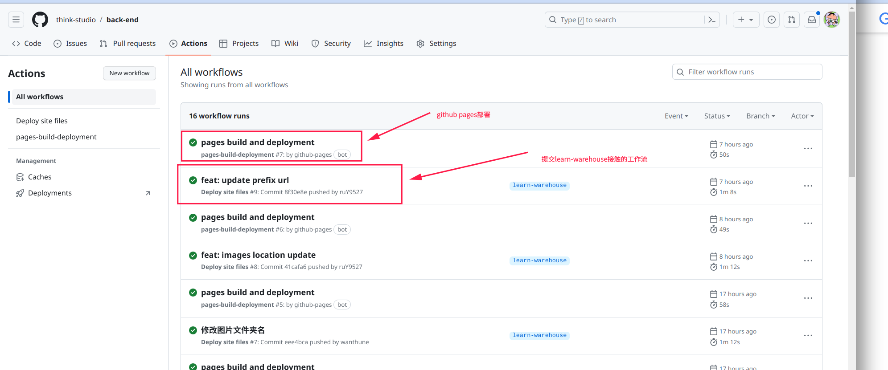

# 知识沉淀

## 说明

分支使用:  learn-warehouse

通过 .github/workflows下的deploy.yml借助github帮我们部署

然后采用github pages来进行部署

建议在使用魔法的情况下进行访问

[vuepress](https://vuepress.vuejs.org/zh/guide/) 我们使用的vuepress进行管理

## 本地开发

node:  v14.12.0

node 建议使用 nvm来进行统一的依赖管理   [nvm安装](https://github.com/nvm-sh/nvm)     [nvm-windows安装](https://github.com/coreybutler/nvm-windows)

1. 依赖安装 :  npm install

2. 然后执行： npm run dev

然后控制台可以看到访问的ip和端口

## 配置说明

在 docs 下有一个隐藏的文件夹 .vuepress ; 其中有一个 config.js 来进行管理

nav : 配置顶部的导航

sidebar： 根据顶部的导航 url 来配置点击顶部的展示侧边的导航

children:  没在对应的路径添加一个文件,就在此处进行配置

添加完后,可在本地看执行的效果

**假设我要修改文件的名字或者新增文件夹等信息,都需要到config .js进行对应的配置**

## 编写文章 

基于learn-warehouse分支来进行内容编写,提交到learn-warehouse分支,会通过github的工作流来触发编译和push静态资源到master

- 静态资源存放位置 :   docs/.vuepress/public/assets 下的  img 分别创建对应模块的文件夹存放图片

- md文档中引用图片:    /back-end/assets/img/threads/JMM规范示意图.png     从 img 替换成 我们存放的图片地址

  /back-end 是我们 .vuepress中的config.js 存储的前缀

  /assets/img  是我们同一存放静态资源等位置

  threads/JMM规范示意图.png 是我们引入存放图片的位置

  **注意： 如果本地md按照这种路径写法看不到图片是正常的;使用npm run dev是可以看到的**

  原理:  https://github.com/think-studio/back-end/tree/master/assets/img   最后图片的静态资源会统一编译存放在此处;所以相当于是 域名+config前缀+存放静态静态的路径

  think-studio.github.io(域名)/back-end(前缀)/+assert/img/xxx(静态资源路径)

## 贡献

欢迎fork项目提交pr来贡献大家学习的知识;一起前进

## 联系方式(备注github学习)

- by_coder